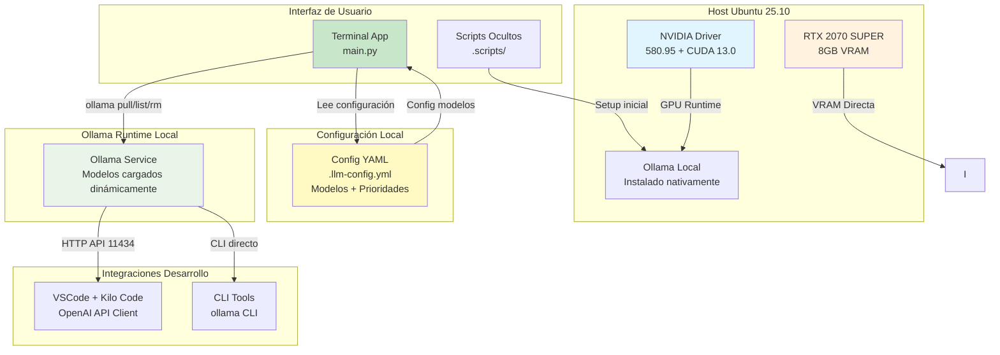

# Arquitectura Simplificada: Ollama Local Nativo



## Arquitectura Simplificada: Ollama Local

### ✅ Ventajas de Ollama Local Nativo
- **Mínimo Overhead**: Sin Docker = ~50MB RAM vs 200MB+ contenedor
- **Arranque Instantáneo**: 3-5s vs 10-15s contenedor
- **GPU Directa**: Mejor afinidad con RTX 2070 SUPER
- **Simplicidad**: Un comando `ollama pull/rm` directo
- **Desarrollo Fluido**: Perfecto para iteración rápida

### 🔄 Gestión de Modelos Directa
```
App Python → CLI Directo → ollama pull qwen2.5-coder:7b
                        → ollama list
                        → ollama stop deepseek-coder
```

### 📋 Configuración Externa (YAML)
```yaml
# config/models.yml
global:
  ollama_host: "http://localhost:11434"
  max_loaded_models: 2
  auto_stop_inactive: true

models:
  qwen:
    name: "qwen2.5-coder:latest"
    description: "Code completion and programming"
    category: "coding"
  deepseek:
    name: "deepseek-coder:latest"
    description: "Technical reasoning and analysis"
    category: "reasoning"
  mistral:
    name: "mistral:latest"
    description: "Documentation and architecture"
    category: "general"
```

### 🛠️ Componentes Simplificados

#### 1. **OllamaManager** (ollama_manager.py)
- **Responsabilidades**: Gestión directa de Ollama CLI + actualizaciones automáticas
- **Métodos**:
  - `pull_model()`, `list_models()`, `remove_model()`
  - `get_running_models()`, `stop_model()`
  - `get_vram_usage()`, `check_model_updates()`
  - `update_model_if_available()` - Actualización automática

#### 2. **ConfigManager** (config_manager.py)
- **Responsabilidades**: Carga configuración YAML
- **Funciones**: Validación, prioridades, metadata modelos

#### 3. **CLI Interface** (cli.py)
- **Responsabilidades**: Menú interactivo simplificado
- **Características**: Estado real-time, progress bars

### 🚀 Setup Inicial Simplificado
```bash
# 1. Instalar Ollama
curl -fsSL https://ollama.com/install.sh | sh

# 2. Instalar app Python
pip install -r requirements.txt

# 3. Ejecutar
python main.py
```

### 📊 Comparativa Final

| Aspecto | Ollama Local ✅ | Single Container | Multi Container |
|---------|-----------------|------------------|----------------|
| **Overhead RAM** | ~50MB | ~200MB | ~600MB |
| **Arranque** | 3-5s | 10-15s | 30-45s |
| **GPU Affinity** | ⭐⭐⭐⭐⭐ | ⭐⭐⭐⭐ | ⭐⭐⭐ |
| **Simplicidad** | ⭐⭐⭐⭐⭐ | ⭐⭐⭐⭐ | ⭐⭐ |
| **Desarrollo** | ⭐⭐⭐⭐⭐ | ⭐⭐⭐ | ⭐⭐ |

**Conclusión**: Para desarrollo local con RTX 2070 SUPER, **Ollama Local Nativo** es la arquitectura óptima.

