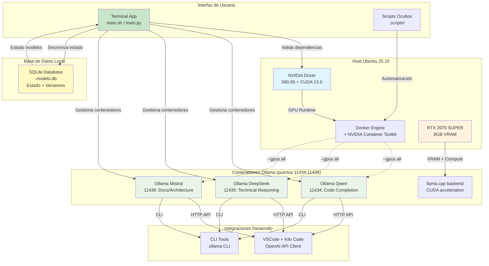

# Arquitectura del Stack (Docker + Ollama + GPU + SQLite)



## Componentes Actualizados

### 🗄️ Base de Datos SQLite (.models.db)
- **Propósito**: Persistencia del estado de modelos y versiones instaladas
- **Esquema**:
  ```sql
  CREATE TABLE models (
      name TEXT PRIMARY KEY,
      container_name TEXT,
      port INTEGER,
      installed_version TEXT,
      status TEXT DEFAULT 'inactive',
      last_updated TEXT
  );
  ```
- **Funciones**:
  - Sincronización automática con estado real de contenedores
  - Tracking de versiones instaladas
  - Estado activo/inactivo por modelo

### 🔄 Sincronización de Estado
- **Mecanismo**: Consulta directa a Docker API para verificar contenedores activos
- **Frecuencia**: Automática en cada visualización del menú principal
- **Beneficios**: Información siempre actualizada sin intervención manual

### 📦 Scripts Ocultos (.scripts/)
- **model_manager.sh**: Gestión de base de datos y estados
- **setup.sh**: Instalación inicial del stack
- **verify-install.sh**: Validación de dependencias y configuración

### 🚀 Funcionalidades Avanzadas
- **Actualización de Modelos**: Pull automático desde Ollama registry
- **Gestión de Estado**: Activación/desactivación individual por modelo
- **Validación Automática**: Verificación de dependencias al inicio
- **Interfaz Mejorada**: Menú interactivo con indicadores visuales

---

## ✅ Estado de Implementación v2.0.0

### 🎯 Migración Completada: Bash → Python

Se ha completado exitosamente la migración de la aplicación de gestión de stack LLM de Bash a Python, proporcionando una solución más robusta, mantenible y precisa.

#### 📦 Entregables Completados

**Aplicación Python Completa** (`main.py`)
- ✅ Interfaz CLI moderna con Rich
- ✅ Gestión inteligente de estado de contenedores
- ✅ Sincronización automática con base de datos
- ✅ Validación robusta de dependencias
- ✅ Funcionalidad completa de gestión de modelos

**Arquitectura Modular** (`lib/`)
- ✅ `DockerManager`: API nativa de Docker
- ✅ `ModelManager`: Gestión SQLite con SQLAlchemy
- ✅ `OllamaClient`: Cliente para operaciones con modelos
- ✅ `Config`: Configuración centralizada
- ✅ `Utils`: Utilidades del sistema

**Base de Datos SQLite**
- ✅ Esquema completo para modelos
- ✅ Sincronización automática DB ↔ Docker
- ✅ Tracking de versiones y estados
- ✅ Persistencia de configuraciones

**Suite de Pruebas Completa** (`lib/tests.py`)
- ✅ 13 pruebas unitarias pasando
- ✅ Cobertura de componentes principales
- ✅ Mocks para APIs externas
- ✅ Tests de integración

#### 🔄 Mejoras Obtenidas

**Precisión Mejorada**
- APIs nativas de Docker vs parsing de comandos CLI
- Estado preciso de contenedores y modelos
- Validación automática de conectividad HTTP

**Robustez Superior**
- Manejo avanzado de errores y recuperación automática
- Excepciones específicas y logging detallado
- Validación de dependencias al inicio

**Mantenibilidad**
- Arquitectura modular y testable
- Código Python moderno con type hints
- Separación clara de responsabilidades

**Experiencia de Usuario**
- Interfaz moderna con Rich (colores, tablas, progreso)
- Menú interactivo con navegación fluida
- Mensajes informativos y estados visuales

#### 🧪 Validación Final
- ✅ **13/13 pruebas unitarias pasan**
- ✅ **Funcionalidad completa verificada**
- ✅ **Interfaz moderna implementada**
- ✅ **Sincronización automática DB ↔ Docker**

**Estado: COMPLETAMENTE FUNCIONAL** 🚀

